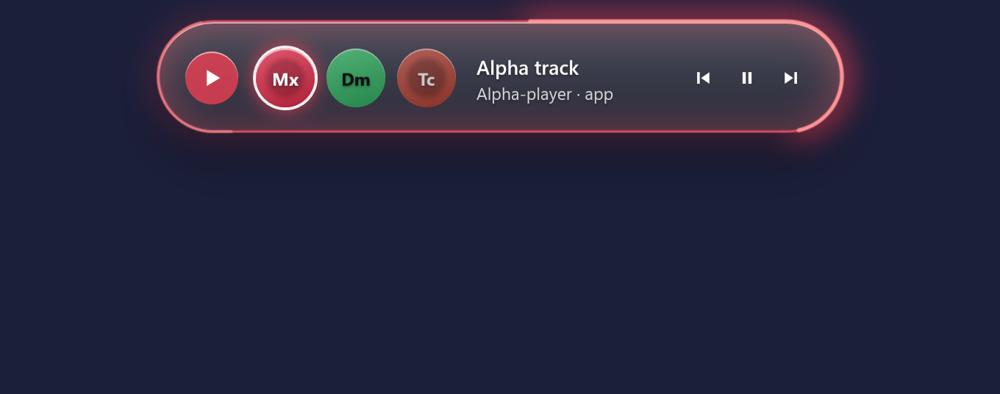

# Island

Island is a small glass island at the top of your Windows screen. One key brings it, and it keeps the programs, folders and websites you use most on a few coloured pages, one click or one key away.




*Both pictures are drawn by Island's own self-test, with invented names.*

## Download

**[Download Island for Windows](https://github.com/SnoweyLabs/island/releases/latest/download/Island-Setup.exe)** (about 54 MB). This link always gives the newest version.

Double-click `Island-Setup.exe`. It installs for you only, without asking for administrator rights, puts Island in the Start menu, and can start it at the end.

**Windows will warn you.** The installer is not signed with a paid certificate, so Windows shows "Windows protected your PC". Click **More info**, then **Run anyway**. Some antivirus programs may also be wary of a new, unsigned installer. If you would rather check the file first, every release lists its SHA-256 checksum in `SHA256SUMS.txt`.

**What it needs:** Windows 11 on an ordinary (x64) computer. Island 1.0.0 was made and tried on one Windows 11 laptop. It has not been tried on Windows 10, on ARM computers, or on any other computer yet. The installer does not refuse them, but nobody knows how well it works there.

There are no automatic updates: Island never contacts the internet. To update, download the installer again from the same link and run it.

## First steps

- **Ctrl+Q** brings the island and hides it again. You can choose another key in Settings → Your key.
- The island has pages: Media, Folders, Apps, Vibe coding, Browser and Terminals. **Tab** goes to the next page, **Shift+Tab** to the one before, and **1** to **9** open the pages in their order. Drag a page by its handle in Settings → Your pages to change the order. A page can also have a key of its own.
- **Left** and **Right** move along the row; **Enter** does what a click does: it starts a program, opens a folder or a website, or brings its window to the front.
- **Down** opens a second row with what is open now. **Shift+Enter** there adds the thing to the page. **Up** goes back.
- **Space** plays or pauses on the Media page. **Delete**, then **Delete** again, takes the selected thing off the island (it closes nothing). **Esc** closes the second row first, then the island.
- **Search:** start typing while the island is open. The things that match come first, then three more: search on YouTube, on Google, or on this computer (File Explorer's search, for files and folders).
- **Adding things:** the **+** on the island, or Settings → What goes on the island → **Add…** for a program, a folder, a website or a file.
- **Settings** opens from Island's icon in the taskbar's notification area. The first start walks you through a short setup with a little practice on the real island. You can do it again from Settings → General → **Run the setup again**.

### The Terminals page and coding helpers

The Terminals page fills itself: one round tile for each terminal window. If you use **Claude Code** or **Codex**, Island can show which of them is working (a blue ring), waiting for you (orange) or finished (green), and tell you when one has finished.

To use that, open Settings → **Coding agents** and press **Connect** for the helper. Island first shows you the exact lines and the file, and writes nothing until you confirm:

- Claude Code: entries in `%USERPROFILE%\.claude\settings.json`.
- Codex: entries in `%USERPROFILE%\.codex\hooks.json`.

Before the first change Island saves a copy of the file as it was, beside it. It also copies a small program, `Island.Notify.exe`, into `%LOCALAPPDATA%\Island\notify`, which the helper runs to tell Island what it is doing. **Disconnect** takes out exactly those entries and nothing else. Restart your helper sessions after connecting or disconnecting.

## The Chrome add-on (optional)

Island works without it; then websites on the island are shortcuts that open in your browser. With the add-on, Island can also see your browser tabs: which sites are open and which one is playing, switch to a tab, and close it.

The add-on is not in the Chrome Web Store. The first start shows how to load it (the step Chrome); to do it later, by hand:

1. In Island, open Settings → General and press **Open the add-on folder**.
2. In Chrome, go to `chrome://extensions` and switch on **Developer mode** (top right).
3. Click **Load unpacked** and choose the folder that opened in step 1.

The add-on talks only to Island on your own computer (`127.0.0.1`). It fetches nothing from the internet and sends nothing to any server.

## Privacy

- Island never contacts the internet. It has no account, no analytics, no ads and no update check. When you click a website on the island, it hands the address to your browser, as if you had typed it.
- While it runs, Island reads which windows are open and which program is in front, which known folders are open, what media is playing, the programs installed on your computer and, with the add-on, your browser tabs' titles and sites. It keeps all of that in memory only. What you type into its search is never written anywhere.
- It writes only these files: your settings, pages, picks and scenes in `%APPDATA%\Island`, and a short log of its own events in `%LOCALAPPDATA%\Island`. The log never holds a window title, a program list, your name or anything you typed.
- It writes outside those folders only when you press a button for it: **Start with Windows** (one value in your own start-up list) and **Connect** for a coding helper (above).

## Uninstall

Windows Settings → Apps → Installed apps → **Island** → **Uninstall**. If Island is running, the uninstaller asks you to close it first (from its icon: **Quit**). It disconnects any coding helper you connected, switches Start with Windows off, and removes the program and `%LOCALAPPDATA%\Island`. Your own settings and picks in `%APPDATA%\Island` are kept, so installing Island again brings them back. Delete that folder if you do not want them.

## Build it yourself

You need the .NET 10 SDK on Windows.

```
dotnet build Island.sln
dotnet test Island.sln
dotnet run --project src/Island.App -c Release
```

The self-test, which draws the pictures in `review/`, runs with `--selftest <folder>`. The installer is built with Inno Setup 6 (jrsoftware.org):

```
powershell -ExecutionPolicy Bypass -File ship/installer/build.ps1 -Installer
```

It makes the self-contained build in `ship/app` and the installer in `ship/installer/out`.

## How it was made

Island was built with Claude Code, Anthropic's coding agent, from written work orders. A person decided what Island should do and how it should look, and checked it on a real screen. Claude wrote the code, the tests and the self-test that draws the pictures. It is made by SnoweyLabs ([snoweylabs.com](https://snoweylabs.com)).

## Licence

MIT. See [LICENSE](LICENSE). The .NET runtime inside the installer is Microsoft's, also under the MIT licence: see [THIRD-PARTY-NOTICES.md](THIRD-PARTY-NOTICES.md).
