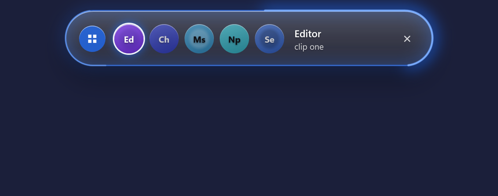

# Island

A small glass island at the top of your Windows screen. One key brings it, and it keeps the programs, folders and websites you use most one click or one key away.

**[Download Island for Windows](https://github.com/SnoweyLabs/island/releases/latest)** — free, version 1.0.0, Windows 11 (x64), about 54 MB.

**Windows will warn you.** The installer is not signed with a paid certificate, so Windows shows "Windows protected your PC". Click **More info**, then **Run anyway**.

## What it does

- **One key, everything you use.** Press Ctrl+Q: your programs, folders and sites, on coloured pages.
- **Knows what is open.** A click starts a program or brings its window to the front; the island shows what plays and what your terminals are doing.
- **Stays out of the way.** It keeps away from games and fullscreen programs, and leaves by itself.

**Open source.** The code is on GitHub under the MIT licence: https://github.com/SnoweyLabs/island

**Privacy.** Island never contacts the internet. What it reads about your windows stays in memory, and it keeps only your own choices, on your own computer.

---

*Notes for whoever puts this on snoweylabs.com (not part of the page):* the download button goes to the release page above, which always shows the newest version; the direct file link, if you prefer one, is https://github.com/SnoweyLabs/island/releases/latest/download/Island-Setup.exe. The two pictures are drawn by Island's own self-test with invented names, 1360 x 536 pixels, about 110 KB each.
